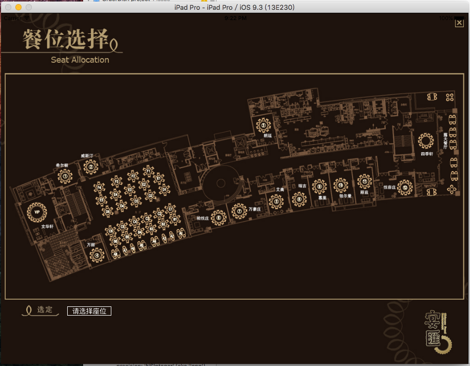
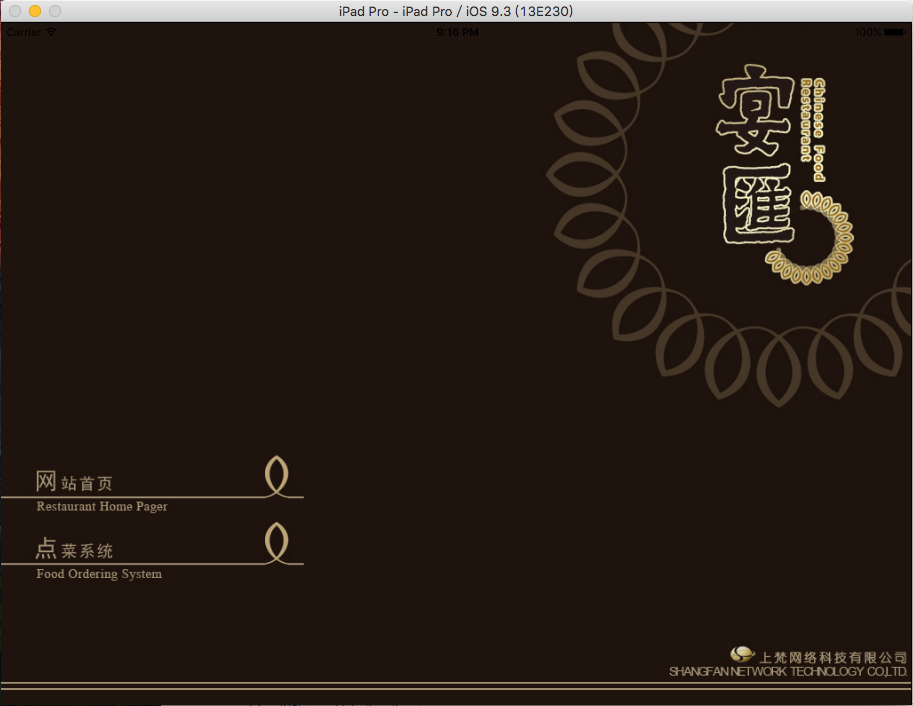

# Diancai
基于sqlite数据库的ipad点菜项目

本系统使用sqlite数据库事项数据的存储，更改，删除等操作。根据饭店的实际要求设计了：主厨推荐和多个分类的点菜页面，选择座位功能，菜单显示，历史菜单等功能。

==========

###
Autor:Haven

###
E-mail:HavenMailBox@163.com(欢迎骚扰)

==========

##目录

* [GIF图片](#GIF图片)
* [首页](#首页)
* [主页](#主页)
* [点菜页](#点菜页)
* [详细页](#详细页)
* [我的点单页](#我的点单页)
* [送单页](#送单页)
* [历史菜单页](#历史菜单页)
* [数据库页](#数据库页)

==========

GIF图片
----------

首页
----------

主页
----------

点菜页
----------

详细页
----------

我的点单页
----------

送单页
----------

历史菜单页
----------

数据库页
----------

